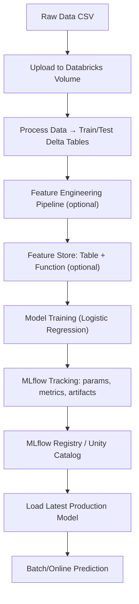

# 🏨 Hotel Reservation - End-to-End MLOps with Databricks

[](https://databricks.com)
[](https://databricks.com)
[](#)
[](#)

An **end-to-end MLOps project** developed as part of the *Marvelous MLOps Databricks Course (Cohort 4)*.
It automates the lifecycle of a **hotel reservation classification model**, from **data ingestion & feature engineering** to **model training, registration, and deployment** on Databricks.


## 🧠 Project Description

This repository demonstrates:

* **Reproducible ML pipelines** using **Databricks, MLflow**, and **LightGBM**
* **Multi-environment management** across **DEV / ACC / PRD**
* **Data ingestion → preprocessing → feature engineering → model training**
* **Databricks Feature Store & Feature Lookup** integration
* **Task automation** with Devbox + UV + Taskfile
* **CI/CD** with GitHub Actions & GitLab CI (including docs build)
* **Testing & QA** with pre-commit, Ruff, and Pytest (Spark/Delta mocked)


## 🧰 Technology Stack

### Core Stack


### Dev Tools


### Version Control & CI/CD


## ⚙️ Installation & Setup (Taskfile)

```bash
# 1. Clone
git clone <your-repo-url>
cd hotel_reservation

# 2. Install tooling
task install

# 3. Create & sync Python env
task dev-install

# 4. Configure environment
cp .env.template .env
# → update with GitHub token / Databricks creds

# 5. Run demo
task demo
````


## 🧩 Project Overview

### 📂 Structure

```
hotel_reservation/
│
├── src/hotel_reservation/
│   ├── data/            # Data ingestion & upload
│   ├── feature/         # Feature engineering (DataProcessor, FE Store utils)
│   ├── model/           # Model training & registry
│   ├── utils/           # Config, env loader, timing
│   └── vizualization/   # Placeholder for visualizations
│
├── scripts/
│   ├── run_upload_data.py          # Upload CSV to Databricks volume
│   ├── run_process_data.py         # Create train/test tables
│   ├── run_create_mlflow_workspace.py
│   ├── run_cleanup_mlflow_experiments.py
│   ├── train_register_model.py     # Train & register baseline model
│   └── train_register_fe_model.py  # NEW: Train with Feature Store + FE lookup
│
├── data/                  # Local datasets
├── docs/                  # Documentation (built via GitLab CI)
├── tests/                 # Unit tests (Pytest + Spark/Delta mocks)
├── project_config.yml     # Config per env (dev/acc/prd)
├── Taskfile.yml           # Tasks (lint, demo, fe_train_register_model…)
├── pyproject.toml         # Dependencies & metadata
└── .github / .gitlab/     # CI/CD configs
```


## 🚀 Key Features

* **End-to-End Workflow**: data upload → feature engineering → training → registry → prediction
* **Feature Store integration**: `train_register_fe_model.py` builds feature tables & lookup functions
* **Environment aware**: `project_config.yml` defines `dev/acc/prd` with separate catalogs & schemas
* **Robust testing**: mocks PySpark & Delta, enabling fast local testing
* **Docs pipeline**: CI builds & publishes Sphinx docs from `docs/hotel_reservation`


## 🧪 Development Workflow

| Command                        | Description                           |
| ------------------------------ | ------------------------------------- |
| `task dev-install`             | Setup dev dependencies                |
| `task demo`                    | Run demo training pipeline            |
| `task run-upload-data`         | Upload dataset to Databricks volume   |
| `task run-process-data`        | Create train/test Delta tables        |
| `task train-register-model`    | Train & register baseline model       |
| `task fe_train_register_model` | **NEW** Train with Feature Store & FE |
| `task lint`                    | Run linters & pre-commit hooks        |
| `task clean`                   | Cleanup env & temp files              |


## 🧱 Prerequisites

* **Mandatory**: Linux/macOS, Python 3.12+, Databricks account/workspace, `task`, `devbox`, `uv`
* **Recommended**: Docker for isolated testing, CI setup (GitHub/GitLab)


## 🧾 Configuration

Example (`project_config.yml`):

```yaml
dev:
  catalog_name: mlops_dev
  schema_name: caotrido
  volume_name: data
  raw_data_file: "Hotel Reservations.csv"
  train_table: hotel_reservations_train_set
  test_table: hotel_reservations_test_set
  feature_table_name: hotel_reservations_features
  feature_function_name: hotel_reservations_feature_fn
  experiment_name_fe: /Shared/hotel_reservations/fe_experiment
```

Switch envs with:

```bash
task run-upload-data -- --env=dev
task fe_train_register_model -- --env=prd
```


## 📊 End-to-End Workflow (Mermaid)




## 🧑‍💻 Contributing

```bash
git checkout -b feature/<your-feature>
task lint
cz commit
git push origin feature/<your-feature>
```

Then open a **Merge Request / Pull Request**.


## 📜 License

Proprietary © 2025 — *Marvelous MLOps Course / Cao Tri Do*
For **educational and internal use only**.
