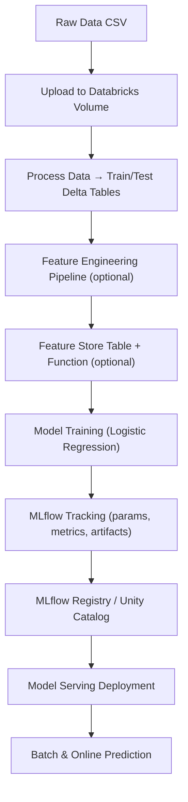

# 🏨 Hotel Reservation — End-to-End MLOps with Databricks

[](https://databricks.com)
[](https://databricks.com)
[](#)
[](#)

An **end-to-end MLOps project** developed as part of the *Marvelous MLOps Databricks Course (Cohort 4)*.
It automates the complete lifecycle of a **hotel reservation classification model**, from **data ingestion & preprocessing** to **model training, registration, deployment, and serving** — fully orchestrated on **Databricks**.

## 🧠 Project Overview

This repository demonstrates:

* **Reproducible ML pipelines** using **Databricks, MLflow**, and **LightGBM**
* **Feature Store** and **Feature Lookup** for scalable feature management
* **Automated Databricks job workflows** using **Databricks Asset Bundles**
* **Multi-environment configuration** across **DEV / ACC / PRD**
* **Environment management & automation** with **Devbox**, **UV**, and **Taskfile**
* **CI/CD** using **GitHub Actions** and **GitLab CI** (builds, docs, tests)
* **Comprehensive testing** with **Pytest**, **Ruff**, and **pre-commit**
* **Documentation & Wiki integration** via **Sphinx** and `wiki-content/`

## 🧰 Technology Stack

### Core Components


### Development Environment


### Version Control & CI/CD


## ⚙️ Installation & Setup

### 1️⃣ Clone the Repository
```bash
git clone <your-repo-url>
cd hotel_reservation
````

### 2️⃣ Open a Devbox Shell

```bash
devbox shell
```

### 3️⃣ Install Tooling

```bash
task install
```

### 4️⃣ Create and Sync Python Environment

```bash
task dev-install
```

### 5️⃣ Configure Environment Variables

```bash
cp .env.template .env
# → update with Databricks credentials, tokens, etc.
```

### 6️⃣ Run Demo Pipeline

```bash
task demo
```

You can verify your setup with:

```bash
task lint
task test
```

## 🧩 Repository Structure

```
malganis35_cohort4/
│
├── src/hotel_reservation/
│   ├── data/              # Data ingestion, upload & config
│   ├── feature/           # Feature engineering and transformations
│   ├── model/             # Model training, registry & Feature Store models
│   ├── serving/           # Model deployment & Databricks model serving
│   ├── utils/             # Config loader, Databricks utils, timing
│   └── vizualization/     # Placeholder for future visualization tools
│
├── scripts/               # Automated Databricks bundle tasks
│   ├── 01.process_new_data.py
│   ├── 02.train_register_model.py
│   ├── 03.deploy_model_serving.py
│   ├── 04.post_commit_status.py
│
├── notebooks/             # Databricks notebooks and local prototypes
│   ├── train_register_model.py
│   ├── train_register_fe_model.py
│   ├── deploy_model_serving.py
│   ├── process_data.py
│   └── utils/
│       ├── run_upload_data.py
│       ├── run_cleanup_mlflow_experiments.py
│       └── run_create_mlflow_workspace.py
│
├── tests/
│   ├── unit_test/         # Unit tests for all modules
│   ├── integration/       # Integration tests (Databricks & MLflow)
│   └── functional/        # E2E functional tests (model deployment)
│
├── docs/                  # Sphinx documentation (auto-built)
├── wiki-content/          # GitHub Wiki export (CI-synced)
├── data/                  # Raw, processed, and external datasets
├── .github/ & .gitlab/    # CI/CD configurations
├── databricks.yml         # Databricks Asset Bundle definition
├── project_config.yml     # Environment-specific parameters
├── Taskfile.yml           # Task automation commands
└── pyproject.toml         # Project metadata & dependencies
```

## 🚀 Key Features

* **End-to-End ML Lifecycle:** Data upload → Feature Engineering → Training → Registry → Serving
* **Databricks Feature Store Integration:** Feature tables and lookup functions for reusable features
* **Asset Bundle Deployment:** Automated workflows defined in `databricks.yml`
* **Environment-Aware Configuration:** Per-env catalog/schema setup (`dev`, `acc`, `prd`)
* **Testing:** Full unit, integration, and functional coverage using Pytest
* **Docs & Wiki:** Built automatically via CI from `docs/` and `wiki-content/`
* **Code Quality:** Pre-commit hooks, linting, and commit message enforcement via Commitizen

## ⚙️ Databricks Asset Bundle Workflow

The deployment and automation pipeline is defined in `databricks.yml`.
It orchestrates the following Databricks tasks:

1. **Preprocessing** — Runs `scripts/01.process_new_data.py`
2. **Model Training** — Runs `scripts/02.train_register_model.py`
3. **Conditional Deployment** — Deploys only if a new model version is created
4. **Serving Update** — Uses `scripts/03.deploy_model_serving.py`
5. **Post-Commit Check** — Optionally validates CI integration results

You can run the workflow directly from CLI:

```bash
databricks bundle deploy
databricks bundle run deployment --target dev
```

## 🧪 Development & Testing Workflow

| Command                        | Description                                |
| ------------------------------ | ------------------------------------------ |
| `task dev-install`             | Setup dev dependencies                     |
| `task demo`                    | Run full demo pipeline locally             |
| `task run-upload-data`         | Upload dataset to Databricks volume        |
| `task run-process-data`        | Create train/test Delta tables             |
| `task train-register-model`    | Train and register baseline model          |
| `task fe_train_register_model` | Train with Feature Store & Feature Lookup  |
| `task lint`                    | Run Ruff, formatters, and pre-commit hooks |
| `task clean`                   | Clean environment and temporary files      |
| `pytest`                       | Run all unit/integration/functional tests  |

## 🧱 Prerequisites

* **Required:** macOS/Linux, Python ≥3.12, Databricks workspace, `task`, `devbox`, `uv`
* **Optional:** Docker (for isolated testing), CI/CD setup with GitHub or GitLab runners

## 🧾 Configuration Example

```yaml
dev:
  catalog_name: mlops_dev
  schema_name: caotrido
  volume_name: data
  raw_data_file: "Hotel Reservations.csv"
  train_table: hotel_reservations_train_set
  test_table: hotel_reservations_test_set
  feature_table_name: hotel_reservations_features
  feature_function_name: hotel_reservations_feature_fn
  experiment_name_fe: /Shared/hotel_reservations/fe_experiment
```

Switch environments easily:

```bash
task run-upload-data --env=dev
task fe_train_register_model --env=prd
```

## 📊 End-to-End Workflow



## 🧑‍💻 Contributing

```bash
git checkout -b feature/<your-feature>
task lint
cz commit
git push origin feature/<your-feature>
```

Then open a **Merge Request / Pull Request** via GitHub or GitLab.

Refer to the [CONTRIBUTING](CONTRIBUTING) file for full contribution guidelines.

## 📚 Documentation

* **Wiki** synced from `/wiki-content/` via CI
* **Reports & Figures** stored under `/docs/reports/figures/`

## 📜 License

Proprietary © 2025 — *Marvelous MLOps Course / Cao Tri Do*
For **educational and internal use only**. See the [LICENCE](LICENCE) file for details.
